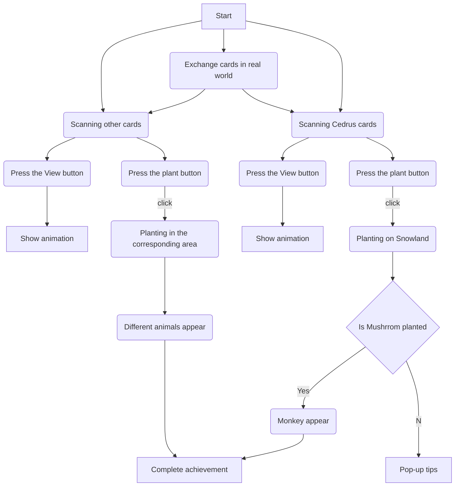

# ISLAND
## introduction
Island is a game developed on Unity. In the game, the player will start having an empty island which will be shown on the screen. By collecting physical cards of different plants and scanning them by camera, the player can generate an augmented reality (AR) model. Then, the player can select the corresponding area to grow plants and click on the plants to unlock five different animals.Through the interaction with plants, players will gradually unlock and discover various animals, increasing the fun and exploration of the game.

After different plants are planted, different animals will be created with them. We hope that this game can make people pay attention to environmental protection and the protection of ecological diversity.

Island combines elements of placement games, biodiversity and augmented reality to provide players with a unique experience. Players will collect and exchange cards with other players in the game to eventually unlock all animals.

## The technologies we use
Unity

Blender

Adobe Illustrator

Ar SDK: Vuforia

## Game Flow

## What I did in this Project
1.Modeling in blender
![image]https://github.com/zhangxiangna/CreativeMakingFinalProject/blob/main/image/Plant.png
2.Production of AR effect

3.Making physical cards
