# ISLAND
## introduction
Island is a game developed on Unity. In the game, the player will start having an empty island which will be shown on the screen. By collecting **physical cards** of different plants and scanning them by camera, the player can generate an augmented **reality (AR) model**. Then, the player can select the corresponding area to grow plants and click on the plants to unlock five different animals.Through the interaction with plants, players will gradually unlock and discover various animals, increasing the fun and exploration of the game.

After different plants are planted, different animals will be created with them. We hope that this game can make people pay attention to environmental protection and the protection of ecological diversity.

Island combines elements of placement games, biodiversity and augmented reality to provide players with a unique experience. Players will collect and **exchange cards with other players** in real world to eventually unlock all animals.

## The technologies we use
Unity

Blender

Adobe Illustrator

Ar SDK: Vuforia

## Game Flow

```mermaid
flowchart  TD;
    A[Start] --> B(Scanning other cards)
    A -->S(Exchange cards in real world)
    S -->B 
    S -->E 
    B --> D(Press the View button)
    A -->E(Scanning Cedrus cards)
    B -->G(Press the plant button)
    G --click-->C(Planting in the corresponding area)
    C -->H(Different animals appear)
    E -->J(Press the View button)
    J -->Q[Show animation]
    D -->R[Show animation]
    E -->K(Press the plant button)
    K --click-->N(Planting on Snowland)
    N -->L{Is Mushrrom planted}
    L --Yes-->M(Monkey appear)
    L --No-->O[Pop-up tips]
    M -->P[Complete achievement]
    H -->P
```


## What I did in this Project
### 1.Modeling in blender


### 2.Making physical cards

{width=30px height=40px}


### 3.Production of AR effect
**Previous Plans:**
Before, our plan was to scan the poster, project an augmented reality island, and then use the mouse to click on the island to generate a tree at the corresponding location, and click on the tree again to possibly have animals appear. And there will be some virtual buttons on the poster to interact with the island.


I mainly use two functions in augmented reality, the first one is to generate an augmented reality island by recognizing pictures in reality.


The second feature is the virtual button function, which interacts with the augmented reality island on the screen by overlaying a part of the picture in reality in order to let players feel different ways of interaction
```ruby
public class BtnMouse : MonoBehaviour
{
    public int MouseZhuangtai = 0;
    private VirtualButtonBehaviour[] buttons;

    void Start()
    {
        buttons = this.GetComponentsInChildren<VirtualButtonBehaviour>();

        for (int i = 0; i < buttons.Length; i++)
        {
            if (buttons[i].VirtualButtonName == "Grass")
            {
                buttons[i].RegisterOnButtonPressed(PressGrass);
            }
            else if (buttons[i].VirtualButtonName == "Tree")
            {
                buttons[i].RegisterOnButtonPressed(PressTree);
        }
    }

    private void PressGrass(VirtualButtonBehaviour obj)
    {
        MouseGrass();
        Debug.Log(obj.VirtualButtonName + " pressed");
    }

    private void PressTree(VirtualButtonBehaviour obj)
    {
        MouseTree();
        Debug.Log(obj.VirtualButtonName + " pressed");
    }


    private void MouseGrass()
    {
        MouseZhuangtai = 2;
    }

    private void MouseTree()
    {
        MouseZhuangtai = 1;
    }
    }
    }
```


