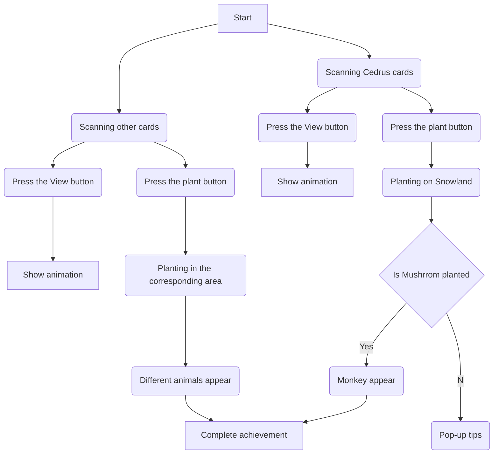

# ISLAND
## introduction
Island is a game developed on Unity. In the game, the player will start having an empty island which will be shown on the screen. By collecting cards of different plants and scanning them, the player can generate an augmented reality (AR) model. Then, the player can select the corresponding area to grow plants and click on the plants to unlock five different animals.

Island combines elements of placement games and augmented reality to provide players with a unique experience. Players will collect and exchange cards with other players in the game to eventually unlock all animals.

## The technologies we use
Unity/n
Blender
Adobe Illustrator
Ar SDK: Vuforia

## Game Flow

