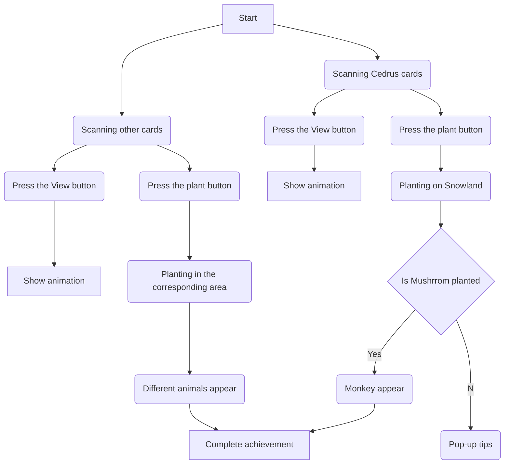

# ISLAND
##introduction
island
##
## Game Flow

```mermaid
flowchart  TD;
    A[Start] --> B(Scanning other cards)
    B --> D(Press the View button)
    A -->E(Scanning Cedrus cards)
    B -->G(Press the plant button)
    G -->C(Planting in the corresponding area)
    C -->H(Different animals appear)
    E -->J(Press the View button)
    J -->Q[Show animation]
    D -->R[Show animation]
    E -->K(Press the plant button)
    K -->N(Planting on Snowland)
    N -->L{Is Mushrrom planted}
    L --Yes-->M(Monkey appear)
    L --No-->O(Pop-up tips)
    M -->P[Complete achievement]
    H -->P
```
